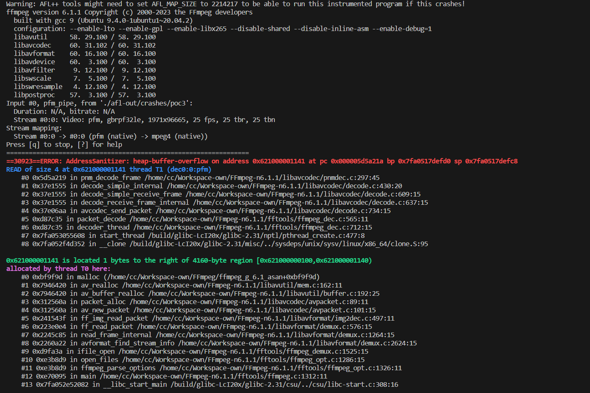

## SUMMARY

A vulnerability was found in FFmpeg up to 7.0.1. It has been classified as critical. This affects the function pnm_decode_frame in the library /libavcodec/pnmdec.c. The manipulation leads to heap-based buffer overflow. It is possible to initiate the attack remotely. The exploit has been disclosed to the public and may be used. Upgrading to version 7.0.2 is able to address this issue. It is recommended to upgrade the affected component. This vulnerability was named CVE-2024-7055.

How to reproduce:

```bash
./configure --enable-lto --enable-gpl --enable-libx265 --disable-shared --disable-inline-asm --enable-debug=1
./ffmpeg_g -i ./poc ./test.mkv
```

ASAN Log:

