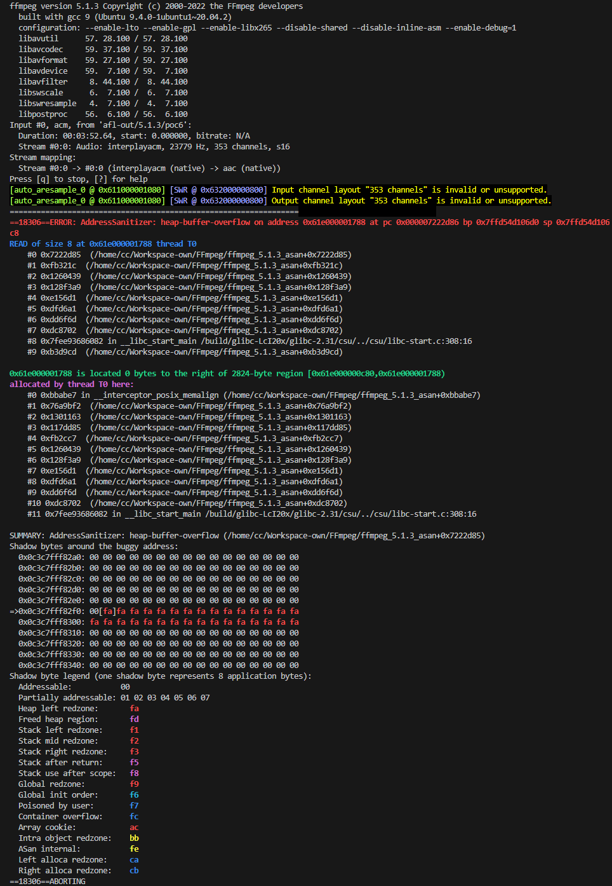

## SUMMARY

A vulnerability has been found in FFmpeg up to 5.1.5 and classified as critical. This vulnerability affects the function fill_audiodata of the file /libswresample/swresample.c. The manipulation leads to heap-based overflow. This vulnerability was named CVE-2024-7272. The attack can be initiated remotely. Furthermore, there is an exploit available. It is recommended to upgrade the affected component.

How to reproduce:

```bash
./configure --enable-lto --enable-gpl --enable-libx265 --disable-shared --disable-inline-asm --enable-debug=1
./ffmpeg_g -i ./poc ./test.mp4
```

ASAN Log:

